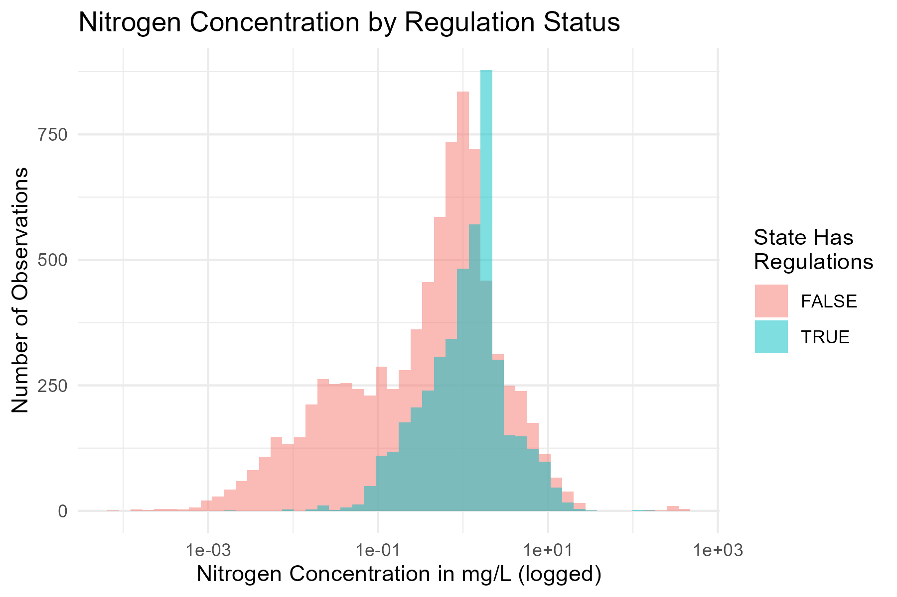
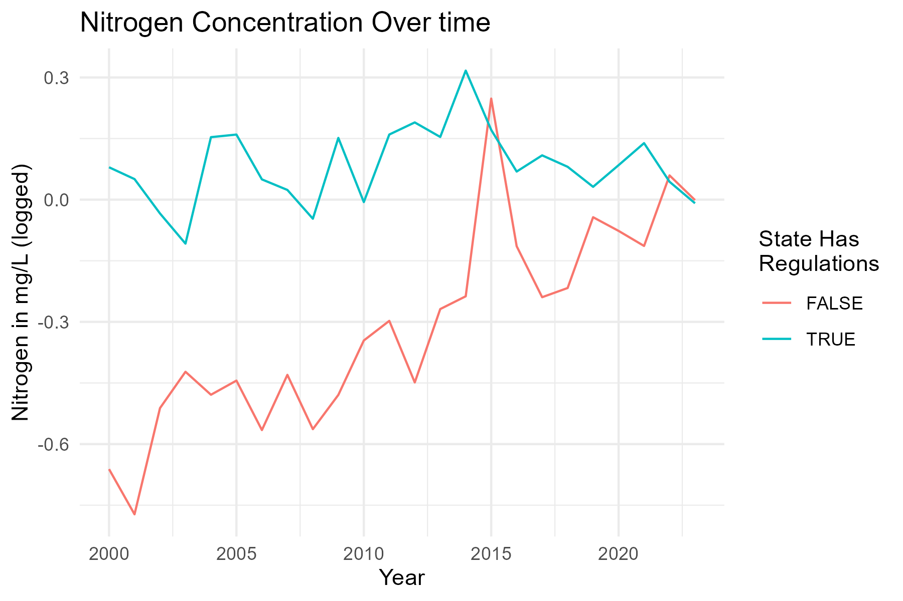
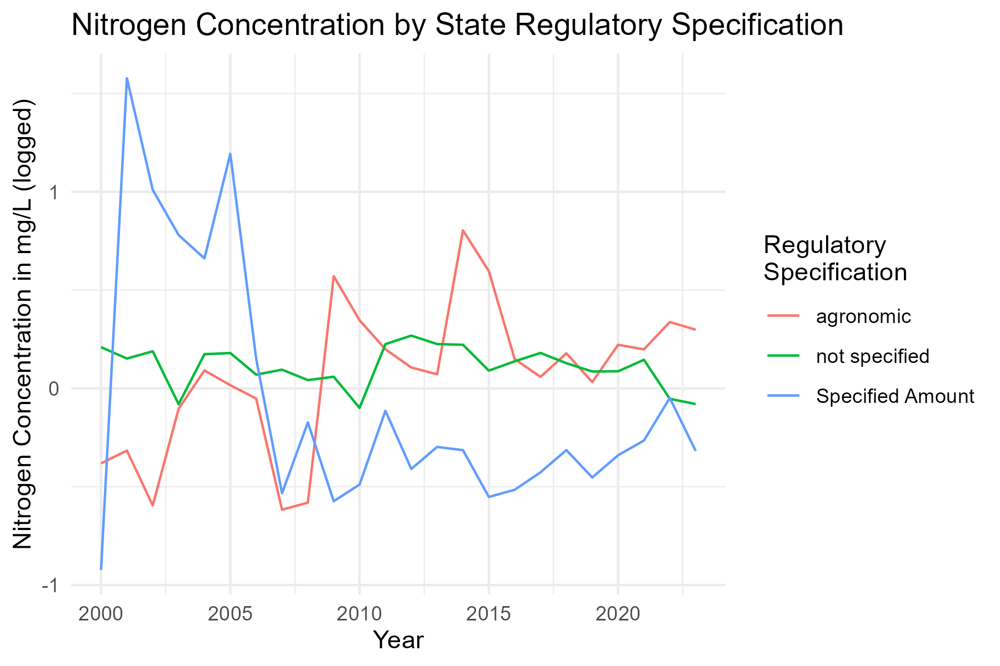
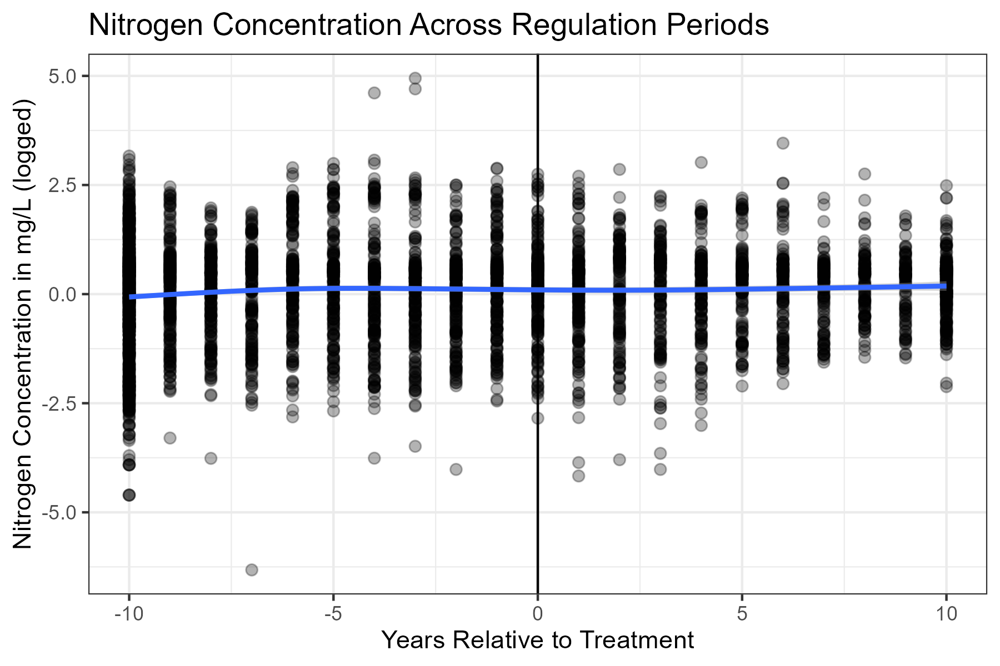
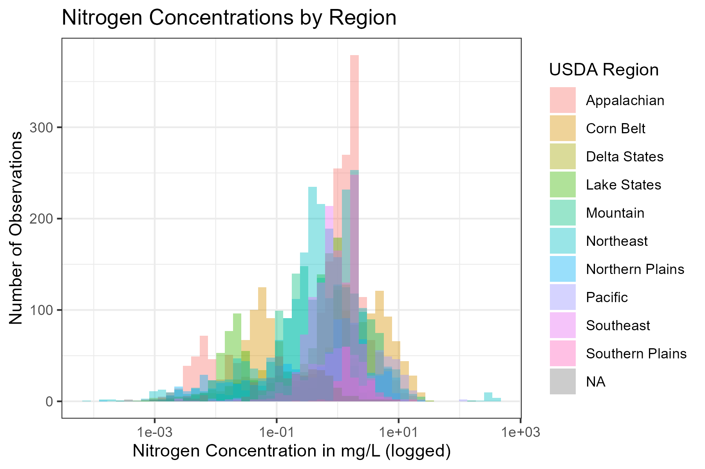

```{r setup, include=FALSE}
knitr::opts_chunk$set(echo = TRUE)
```

## Background

Water scarcity has been a growing issue for decades, especially with regards to agriculture. 2020 saw 3.2 billion people living in agricultural areas with high water scarcity per the United Nations (Water Scarcity, 2020). The UN also notes that water scarcity is projected to increase over time, an effect that–compounded with climate change–will put increasing pressure on food supplies (UN-Water, 2024). This factor is especially significant with 72% of water withdrawals globally being used for agriculture (UN-Water, 2021).

Solutions for water scarcity, therefore, are very important. One solution is the reuse of treated wastewater for irrigation in agriculture, which the EPA notes can create a "reliable, sustainable, and local water supply (EPA, 2024). Reznik et al. (2019) find that the reuse of treated wastewater can be both an "Efficient and sustainable solution for water resource scarcity". However, it is not a perfect solution. The reuse of wastewater can introduce contaminants including metals, salts, and nutrients. These factors can enter and damage both soil and water supplies (Yalin et al., 2023; Trotta et al., 2024).

Among these, nutrient pollution is especially concerning. Nutrient pollution is a type of water pollution consisting of excess compounds of nitrogen and phosphorus. Per the EPA, nutrient pollution is "One of America's most widespread, costly, and challenging environmental problems," (EPA, 2024). The EPA further notes that excess nitrogen pollution can be harmful to human health and wildlife populations: excess nitrogen in bodies of surface waters can cause algae blooms, which can release toxins harmful both to humans and wildlife. Nitrates (a nitrogen compound) can enter drinking water supplies, and can be harmful to humans–or fatal to infants–even in low levels. Mosheim and Sickles (2021) find that nutrient pollution can increase the production costs of water utilities, which is substantiated by EPA findings of water production costs increasing from ten cents per gallon treated up to four dollars per gallon with the installation of a nitrate reduction system (EPA, 2024).

## Data

Our analysis aims to shed light on this trade-off between a sustainable water supply and the reduction of nutrient pollution. We use panel data from several sources to conduct our analysis. Water quality data is collected from USGS and EPA water surveys compiled by the National Water Quality Monitoring Council. This data includes concentrations of nitrogen and nitrogen compounds in various bodies of surface and groundwater in milligrams/liter. Nitrogen is one of the most common aspects of water quality that states have regulations on , so we use this as our primary analysis. These observations were primarily identified by geographic coordinates, which were mapped to U.S. states using GIS data from the Census Bureau. Some observations that did not include coordinates were linked to states using the USGS state-level office that collected the data. This data covers years from 2000 through 2023, as that time period contains most water reuse quality regulations passed by states with such regulations.

The nature and exact specifications of each state's water reuse quality regulations was collected from the EPA's Regulations and End-Use Specifications Explorer (REUSExplorer). We focused primarily on the concentration regulations on nitrogen and nitrogen compounds. The concentrations are primarily measured in milligrams per liter, both in the state regulations and the water quality data. The year each of these regulations was registered with the EPA (or in cases where this information is not known, the most recent state-level regulation) was collected from both the EPA's REUSExplorer and each state's respective administrative code. For year of treatment, we used the year the EPA-recognized policy was established, though we also included the year in which each state first regulated wastewater reuse.

To capture any climate trends that may impact the amount of nitrogen used, we have also included data from the USDA Farm Production Regions. These regions are defined by state borders and capture similarity of crops, which is largely determined by climate.

In the final dataset, the unit of analysis is called *avgvalue*, and this variable contains the average quantity of a given nitrogen compound for each state and year combination. Our analysis looks primarily at nitrogen (as opposed to other compounds thereof) as it is the most consistently regulated by states. The distribution of average value of nitrogen is right-skewed, so a log transformation was applied to normalize the distribution and ease of interpretation.

Some extreme values became apparent during the visualization process. Some state wastewater reuse regulations were first passed long before the time-frame covered by our data (such as California's 1918 regulation). When we analyze average water quality across states relative to the year of treatment, we bin all observations over 10 years before and after the event. Additionally, due to fundamental differences in region, crop, and climate we decided to exclude Alaska and Hawaii from the analysis.

## Visualizations



Our first figure displays distributions of nitrogen concentration for states with and without regulations on nitrogen levels in reused wastewater. The two distributions show similar modes, though states with regulations trend towards higher concentrations. This could imply selection bias, as states with preexisting higher concentrations of nitrogen may be more likely to regulate its levels.



Our second figure shows trends in nitrogen concentration over time for states with and without regulations on nitrogen concentration in reused wastewater. States with regulations have higher values of wastewater on average, and exhibit a slow increase over time. Unregulated states have lower levels of nitrogen concentration, though concentrations are increasing at a faster rate.



Our third figure shows how concentration varies over time by regulatory specification. Different states specify maximum allowed nitrogen concentrations differently. States specifying an "Agronomic Rate" specify acceptable concentrations depending on the need for a specific crop. "Specified Amounts" are specific, measured quantities of nitrogen that are acceptable. States without a specified amount measure, but do not restrict, concentrations of nitrogen in reused wastewater.



Our fourth figure shows individual observations of nitrogen concentrations over time, with time zero being the period when each observation's state enacted the EPA-registered restriction on water quality. Overall trends exhibit minimal change in average concentrations during treatment.



Our final figure shows density of observations for different nitrogen concentrations by region. Concentration distributions change substantially by region. Regions of note include the Corn Belt, which contains a broad distribution of concentrations, and the Appalachian region with a bimodal distribution containing peaks at both low and moderately high concentration values.

## Works Cited

Environmental Protection Agency. (2024, February 5). Reusing Water for Agricultural Activities. Water Reuse. <https://www.epa.gov/waterreuse/reusing-water-agricultural-activities-resources>

National Integrated Drought Information System. (2024). Agriculture. Drought.gov. <https://www.drought.gov/sectors/agriculture#:~:text=The%20depletion%20of%20water%20availability,forage%20irrigation%20and%20watering%20livestock.>

Reznik, A., Dinar, A., & Hernández-Sancho, F. (2019). Treated wastewater reuse: An efficient and sustainable solution for water resource scarcity. Environmental and Resource Economics, 74(4), 1647–1685. <https://doi.org/10.1007/s10640-019-00383-2>

Sharkoff, James L. (2012, November 27). Colorado Nitrogen Leaking Index Risk Assessment. U.S. Department of Agriculture Technical Notes, State of Colorado. <https://efotg.sc.egov.usda.gov/references/public/CO/COATN_97.pdf>

Trotta, V., Baaloudj, O., & Brienza, M. (2024). Risks associated with wastewater reuse in agriculture: Investigating the effects of contaminants in soil, plants, and insects. Frontiers in Environmental Science, 12. <https://doi.org/10.3389/fenvs.2024.1358842>

United Nations. (2021, July). Summary progress update 2021: SDG 6 - water and sanitation for all. UN Water. <https://www.unwater.org/publications/summary-progress-update-2021-sdg-6-water-and-sanitation-all>

United Nations. (2024). Water scarcity: UN-water. UN Water. <https://www.unwater.org/water-facts/water-scarcity>

United Nations. (n.d.). Water – at the center of the Climate Crisis. United Nations. <https://www.un.org/en/climatechange/science/climate-issues/water>

Yalin, D., Craddock, H. A., Assouline, S., Ben Mordechay, E., Ben-Gal, A., Bernstein, N., Chaudhry, R. M., Chefetz, B., Fatta-Kassinos, D., Gawlik, B. M., Hamilton, K. A., Khalifa, L., Kisekka, I., Klapp, I., Korach-Rechtman, H., Kurtzman, D., Levy, G. J., Maffettone, R., Malato, S., … Cytryn, E. (2023). Mitigating risks and maximizing sustainability of treated wastewater reuse for irrigation. Water Research X, 21. <https://doi.org/10.1016/j.wroa.2023.100203>
