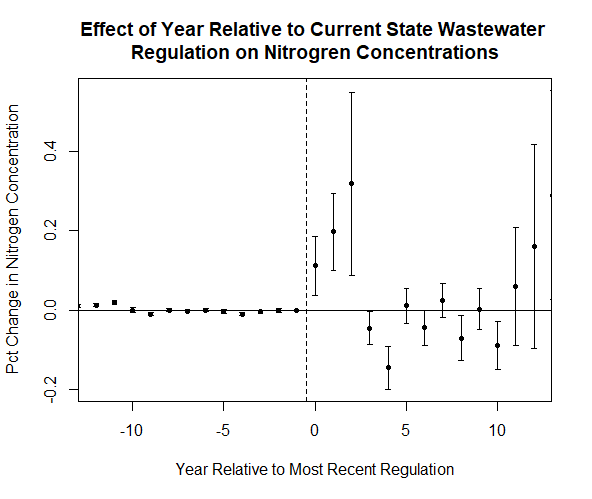

```{r setup, include=FALSE}
knitr::opts_chunk$set(echo = TRUE)
library(tidyverse)
library(fixest)
library(modelsummary)
library(did2s)
library(htmltools)
library(tmap)

```

## Background

Water scarcity has been a growing issue for decades, especially with regards to agriculture. 2020 saw 3.2 billion people globally living in agricultural areas with high water scarcity per the United Nations (Water Scarcity, 2020). The UN also notes that water scarcity is projected to increase over time, an effect that–compounded with climate change–will put increasing pressure on food supplies (UN-Water, 2024). This factor is especially significant with 72% of water withdrawals globally being used for agriculture (UN-Water, 2021).

Solutions for water scarcity, therefore, are very important. One solution is the reuse of treated wastewater for irrigation in agriculture, which the EPA notes can create a "reliable, sustainable, and local water supply. Specifically, wastewater reuse consists of water from sewage systems, stormwater systems, or industrial sources that has been processed for cleanliness to some degree. The degree to which it is processed varies, and is regulated at the state level (EPA, 2024). Reznik et al. (2019) find that the reuse of treated wastewater can be both an "Efficient and sustainable solution for water resource scarcity". However, it is not a perfect solution. The reuse of wastewater can introduce contaminants including metals, salts, and nutrients. These factors can enter and damage both soil and water supplies (Yalin et al., 2023; Trotta et al., 2024).

Among these, nutrient pollution is especially concerning. Nutrient pollution is a type of water pollution consisting of excess compounds of nitrogen and phosphorus. Per the EPA, nutrient pollution is "One of America's most widespread, costly, and challenging environmental problems," (EPA, 2024). The EPA further notes that excess nitrogen pollution can be harmful to human health and wildlife populations: excess nitrogen in bodies of surface waters can cause algae blooms, which can release toxins harmful both to humans and wildlife. Nitrates (a nitrogen compound) can enter drinking water supplies, and can be harmful to humans–or fatal to infants–even in low levels. Mosheim and Sickles (2021) find that nutrient pollution can increase the production costs of water utilities, which is substantiated by EPA findings of water production costs increasing from ten cents per gallon treated up to four dollars per gallon with the installation of a nitrate reduction system (EPA, 2024). The map below depicts the average nitrogen concentration from USGS and EPA water surveys in each state from 2008-2012.

```{r, echo = F, warning = F, message = F, fig.align = 'center'}
##Run file that makes the maps and print
invisible(capture.output(source("../Code/Maps.R", local = knitr::knit_global(), echo = F, print.eval = F, verbose = F)))
stateNitrMap
```

This issue of nutrient pollution–especially nitrogen pollution–has become an issue of great concern to regulators in recent years. As a result, 28 states currently have regulations in place on quality and/or usage of reused water for irrigation of crops, as shown in the map below. Primarily, these regulations affect treated municipal wastewater–a common source of reused wastewater (EPA, 2024). However, little research on how effective these policies are is present in existing literature. Therefore, we seek to analyze how state-level wastewater reuse regulations affect nitrogen concentrations in bodies of water within those states.

```{r, echo = F, warning = F, message = F, fig.align = 'center'}
##Run file that makes the maps and print
invisible(capture.output(source("../Code/Maps.R", local = knitr::knit_global(), echo = F, print.eval = F, verbose = F)))
stateRegMap
```

## Data

We use panel data from several sources to conduct our analysis. Water quality data is collected from USGS and EPA water surveys compiled by the National Water Quality Monitoring Council. This data includes concentrations of nitrogen and nitrogen compounds in various bodies of surface and groundwater in milligrams/liter. Nitrogen is one of the most common aspects of water quality that states have regulations on, so we use this as our primary analysis. These observations were primarily identified by geographic coordinates, which were mapped to U.S. states using spatial data from the Census Bureau. Some observations that did not include coordinates were linked to states using the USGS state-level office that collected the data. This data covers years from 2000 through 2023, as that time period contains the passing of most water reuse quality regulations currently used by states with such regulations.

The nature and exact specifications of each state's water reuse quality regulations was scraped from the EPA's website of Regulations and End-Use Specifications Explorer (REUSExplorer). We focused primarily on the concentration regulations on nitrogen and nitrogen compounds. The concentrations are primarily measured in milligrams per liter, both in the state regulations and the water quality data. The year each of these regulations was registered with the EPA (or in cases where this information is not known, the most recent state-level regulation) was collected from both the EPA's REUSExplorer and each state's respective administrative code. For the year of treatment, we used the year the EPA-recognized policy was established. Many states had regulations prior to their most recent regulation, however we only have data on the details of the most recent regulation.

To capture any climate trends that may impact the amount of nitrogen used, we have also included data from the USDA Farm Production Regions. These regions are defined by state borders and capture similarity of crops, which is largely determined by climate.

In the final dataset, the unit of analysis is the measurement of mg/L of nitrogen. Our analysis looks primarily at nitrogen (as opposed to other compounds thereof) as it is the most consistently regulated by states and sampled. The distribution of average value of nitrogen is right-skewed, so a log transformation was applied to normalize the distribution and to ease interpretation.

Some extreme values became apparent during the visualization process. Some state wastewater reuse regulations were first passed long before the time-frame covered by our data (such as California's 1918 regulation). When we analyze average water quality across states relative to the year of treatment, we bin all observations over 10 years before and after the event. Additionally, due to fundamental differences in region, crop, and climate we excluded Alaska and Hawaii from the analysis.

## Visualizations

```{r, echo = F, warning = F, message = F, fig.align = 'center'}
dataWithoutCat = read_csv("../Data/Clean/stationLevelWithoutCat.csv") 
ggplot(dataWithoutCat, aes(x = avgValue, fill = hasStateReg)) +   
  geom_histogram(position = "identity", alpha = .5, bins  = 50) +   
  theme_bw() +   
  theme_minimal() +   
  xlab("Nitrogen Concentration in mg/L") +   
  ylab("Number of Observations") +   
  labs(title = "Nitrogen Concentration by Regulation Status", fill = "State Has\nRegulations") +        theme(plot.title = element_text(hjust = 0.5)) ##Center title}
```

We initially examined the distributions of nitrogen concentration for states with and without regulations on nitrogen levels in reused wastewater. This distribution is very right skewed, which led to our decision to log-transform the average nitrogen level variable.

```{r, echo = F, warning = F, message = F, fig.align = 'center'}
dataWithoutCat = read_csv("../Data/Clean/stationLevelWithoutCat.csv") 
ggplot(dataWithoutCat, aes(x = avgValue, fill = hasStateReg)) +   
  geom_histogram(position = "identity", alpha = .5, bins  = 50) +   
  scale_x_log10() +   
  theme_bw() +   
  theme_minimal() +   
  xlab("Nitrogen Concentration in mg/L") +   
  ylab("Number of Observations") +   
  labs(title = "Nitrogen Concentration by Regulation Status", fill = "State Has\nRegulations")+   theme(plot.title = element_text(hjust = 0.5)) ##Center title
```

The two log-transformed distributions show similar modes, though states with regulations trend towards higher concentrations. This could imply selection bias, as states with preexisting higher concentrations of nitrogen may be more likely to regulate its levels.

```{r, echo = F, warning = F, message = F, fig.align = 'center'}
dataWithoutCat = read_csv("../Data/Clean/stationLevelWithoutCat.csv")   
dataWithoutCat |>    
  filter(CharacteristicName == "Nitrogen") |>    
  group_by(year, hasStateReg) |>    
  summarise(avgVal = mean(avgValue, na.rm = T)) |>    
  ggplot(aes(x = year, y = avgVal, color = hasStateReg)) +   
  geom_line() +   
  scale_y_log10() +    
  theme_bw() +   
  theme_minimal() +   
  xlab("Year") +   
  ylab("Nitrogen in mg/L") +   
  labs(title = "Nitrogen Concentration Over time", color = "State Has\nRegulations") +   
  theme(plot.title = element_text(hjust = 0.5)) ##Center title
```

We were also interested if there were stochastic trends in nitrogen concentration for states with and without regulations on nitrogen concentration in reused wastewater. States with regulations have higher, more consistent values of wastewater on average. Unregulated states have lower levels of nitrogen concentration, though concentrations do appear to be increasing slightly. The spike in 2015 in unregulated states is from New Hampshire. They report consistently high levels of nitrogen in their water through the year, so we believe that the data is correct. We plan to exclude this observation because we do not believe that it reflect of the data generating process we are trying to model.

```{r, echo = F, warning = F, message = F, fig.align = 'center'}
data = read_csv("../Data/Clean/cleanMergedData_StationLevel.csv") |>    
  select(-`...1`)  |>    
  rename(USDARegion = `USDA Farm Production Region`)   
data |>    
  filter(CharacteristicName == "Nitrogen",
         hasStateReg) |>
  group_by(year, Specification, state, month) |> ##Combine state level data into only relevant categories
  summarize(avgVal = mean(ResultMeasureValue, na.rm = T)) |> 
  mutate(Specification = ifelse(str_detect(Specification, "[0-9]"), "Specified Amount", Specification)) |> ##Group all nums together
  group_by(Specification, year) |> 
  summarise(avgVal = mean(avgVal)) |> 
  ggplot(aes(x = year, y = avgVal, color = Specification)) + 
  geom_line() +
  scale_y_log10() +
  theme_bw() +
  theme_minimal() +
  xlab("Year") +
  ylab("Nitrogen Concentration in mg/L") +
  labs(title = "Nitrogen Concentration by State Regulatory Specification", color = "Regulatory\nSpecification") +
  theme(plot.title = element_text(hjust = 0.5)) ##Center title
```

Our next figure shows how concentration varies over time by regulatory specification. States specify maximum allowed nitrogen concentrations differently. States specifying an "Agronomic Rate" specify acceptable concentrations depending on the need for a specific crop and soil type. "Specified Amounts" are specific, measured quantities of nitrogen that are acceptable. States without a specified amount measure, but do not restrict, concentrations of nitrogen in reused wastewater. There doesn't appear to be any significant difference between the nitrogen concentrations in these states. There is a small downward trend in recent years in states that specify a specific amount, however this sample is small so results are not robust.

```{r, echo = F, warning = F, message = F, fig.align = 'center'}
dataWithoutCat = read_csv("../Data/Clean/stationLevelWithoutCat.csv") |>    
  filter(state != "NH")  
dataWithoutCat |>    
  filter(hasStateReg) |> 
  mutate(event = year - currentRegYear,
         event = ifelse(event > 9, 10, event),
         event = ifelse(event < -9, -10, event))  |> 
  ggplot(aes(x = event, y = avgValue)) +
  geom_point(alpha = .3, size = 2) +
  geom_vline(xintercept = 0) +
  geom_smooth() +
  theme_bw()+ 
  xlab("Years Relative to Treatment") +
  ylab("Nitrogen Concentration in mg/L (logged)") +
  labs(title = "Nitrogen Concentration Across Regulation Periods") +
  scale_y_log10(labels = scales::comma) +
  theme(plot.title = element_text(hjust = 0.5)) ##Center title
```

We were also curious how individual observations of nitrogen concentrations changed relative to when each observation's state enacted the EPA-registered restriction on water quality. Overall trends exhibit minimal change in average concentrations during treatment.

```{r, echo = F, warning = F, message = F, fig.align = 'center'}
dataWithoutCat = read_csv("../Data/Clean/stationLevelWithoutCat.csv") |>    
  filter(!is.na(USDARegion))  

dataWithoutCat |> 
  ggplot(aes(x = avgValue, fill = USDARegion)) +
  geom_histogram(position = "Identity", alpha = .4, bins = 50)  +
  scale_x_log10(labels = scales::comma) +
  theme_bw() +
  xlab("Nitrogen Concentration in mg/L") +
  ylab("Number of Observations") +
  labs(title = "Nitrogen Concentrations by Region", 
       fill = "USDA Region")+
  theme(plot.title = element_text(hjust = 0.5)) ##Center title
```

Our final two figures show density of observations for different nitrogen concentrations by region. Concentration distributions change substantially by region. Regions of note (shown below) include the Corn Belt, which contains a broad distribution of concentrations, and the Appalachian region with a bi modal distribution containing peaks at both low and moderately high concentration values.

```{r, echo = F, warning = F, message = F, fig.align = 'center'}
dataWithoutCat = read_csv("../Data/Clean/stationLevelWithoutCat.csv") |>    
  filter(USDARegion == "Appalachian" | USDARegion == "Corn Belt")  

dataWithoutCat |> 
  ggplot(aes(x = avgValue, fill = USDARegion)) +
  geom_histogram(position = "Identity", alpha = .4, bins = 50)  +
  scale_x_log10(labels = scales::comma) +
  theme_bw() +
  xlab("Nitrogen Concentration in mg/L") +
  ylab("Number of Observations") +
  labs(title = "Nitrogen Concentrations by Region", 
       fill = "USDA Region")+
  theme(plot.title = element_text(hjust = 0.5)) ##Center title
```

## Methods

We evaluate the effects of current state-level policies on nitrogen concentration limits within reused wastewater. The most recent regulations are used due to data constraints. Some states, such as California, have had restrictions on the quality of reused water for well over a century. Information on regulations such as these is very limited, and quality data on nitrogen concentrations is also much more recent. While this fails to capture true changes in water quality regulations over time, it does allow us to develop a general understanding of the effectiveness of current regulations compared to those existing prior. If a state is already regulating the amount of nitrogen in wastewater prior to their most recent regulation, then our results would be positively biased and we would examine less extreme effects from the treatment analyzed.

Several methods were used to estimate the effects of wastewater reuse regulations on nitrogen concentrations in bodies of water; all of these were conducted at the sub-state, individual monitoring station level. The dependent variable of each model was log-transformed. Our first method was a difference-in-differences regression. While lacking in complexity, this model with its numerous fixed effects manages to capture a substantial amount of variance in water quality and identifies effects of legislation with some degree of detail due to the individual water quality monitor level outcomes. It was estimated with the equation:

$Nitrogen_{siymr} = \beta_1Regulation_{sy} + \beta_2Station_{i} + \beta_3Year_y + \beta_4Month_m + \beta_5Region_r + \beta_5Region*Year_{ry}$

Where *Nitrogen* is the log-transformed sample nitrogen concentration, *Regulation* is an indicator of whether or not a water quality regulation was in place in that state at that time, *Station* is the individual water quality monitoring station *i* where each observation was taken, *Year* is the year *y* each observation was recorded, *Month* was the month *m* each observation was recorded, *Region* is the USDA Farm Production Region *r* where each observation was taken, and *Region\*Year* accounts for any regional weather events or broader trends.

Our second method was another application of the difference-in-differences model that analyzed changes in nitrogen concentration as a result of different specifications for nitrogen limits imposed by each state. We conducted this analysis to evaluate whether or not intensity of treatment has any effect on nitrogen concentrations. This model was estimated with the equation:

$Nitrogen_{siymr} = \beta1AmountSpecified_{sy} + \beta2NotSpecified_{sy} + \beta_3State_s +\\ \beta4Station_i + \beta_5Year_y + \beta_6Month_m + \beta7Region_r + \beta_5Region*Year_{ry}$

Where *Nitrogen* is the log-transformed concentration of nitrogen at a specific monitoring station, *AmountSpecified* is an indicator if a state regulation specifies the maximum allowable nitrogen concentration in applied wastewater, *NotSpecified* is an indicator variable equal to 1 if a state regulation did not specify an allowable nitrogen amount, *State* is the state *s* each observation was taken in, *Station* is the individual water quality monitoring station *i* at which each measurement was taken, *Year* is the year *y* each observation was taken in, *Month* is the month *m* each observation was taken in, *Region* is the USDA Farm Production Region *r* each observation was taken in, and *Region\*Year* accounts for any regional weather events or broader trends.

Our final model was a Gardner two stage difference-in-differences model. Recent literature has suggested that staggered treatment difference in differences models can have biased estimates. As a result, we utilized this Gardner (2022) two-stage model in an attempt to account for any potential bias.

## Results

```{r, echo = F, warning = F, message = F}
data = read_csv("../Data/Clean/stationDataWithIndicators.csv") |> 
  filter(CharacteristicName == "Nitrogen") 
data = data |> 
  rename("Station" = MonitoringLocationIdentifier,
         "Month" = month,
         "Year" = year,
         "State" = state,
         "Region" = USDA.Farm.Production.Region)

##Run regression models
regImpactNitrogen = feols(lnMeasureValue ~  currentRegTreated | Month + Year + Station + State + Region + Region^Year, cluster =  "Station", data = data)

regTypeImpactNitrogen = feols(lnMeasureValue ~  regAmountSpecified + regAmountNotSpecified | Month + Year + Station + State + Region + Region^Year, data = data, cluster = "Station")

models = list(regImpactNitrogen, regTypeImpactNitrogen)

##Output table of results
modelsummary(models, gof_omit = "BIC|AIC|RMSE|R2 Adj.|R2", stars = T, output = "output.html",
             coef_map = c("currentRegTreated" = "Regulation Implemented",
                          "regAmountSpecified" = "Exact Regulation",
                          "regAmountNotSpecified" = "Inexact Regulation"),
             title = "Estimated Percentage Effect of Wasterwater Regulation on Nitrogen Concentrations in Water")
htmltools::includeHTML("output.html")
```

Our initial difference in differences model indicated that the presence of regulations on wastewater reuse is correlated with a reduced nitrogen concentrations being reduced by 2.5%. With a standard error of 0.014, this result is statistically significant at the 10% level. This reduction indicates that regulations on the quality of reused wastewater could be effective at reducing nitrogen pollution. If we were to lend a causal inference to this result, the primary difference would be the assumption that regulations directly cause this reduction in nitrogen concentrations. This assumption is unlikely to hold, as a number of other factors not present in the model could also be affecting this data generating process. One such example is the possibility of other effects that occur simultaneously with treatment. Legislation rarely happens in isolated instances, and it is possible that states set out with a goal to reduce pollution and simultaneously enact several policies to that end. For example, if a state were to enact a policy limiting use of fertilizer at the same time they regulated wastewater reuse, our estimate would overstate the effects of wastewater reuse regulations.

Other problems could arise from intensity of treatment, as not all states passed identical regulations. Looking at distinct types descriptively, we find that states regulating–but not specifying–allowable amounts of nitrogen in reused wastewater are correlated with reductions of nitrogen concentrations of 3.6%. With a standard error of 0.012, this result is significant at the 1% level. States that did specify allowable amounts of nitrogen in reused wastewater were correlated with an increase in nitrogen concentrations of 3.0%, though this result was not statistically significant. This result trends in the opposite direction from what was expected. This could be due to selection bias, where the states with the most stringent regulations on nitrogen also have most issues with high nitrogen concentrations. Therefore, we are unable to determine causality from this estimation.

While bias from outside sources is likely, it is also very possible that the estimates used above have internal bias from the models used. To mitigate this, we used a Gardner differences in differences model to estimate the effects, results shown below. The Gardner model finds large, statistically significant increases to nitrogen concentrations in first three years after regulations were passed. The following years the change in nitrogen concentrations is insignificant, or there are small significant decreases. This might be due to states adopting regulations in response to large increases in nitrogen concentrations, but the regulations took a few years to be effective. Here again, we hesitate to assign causality. This is because the noise within our results indicate that other factors not included within our model may be influencing the results in ways we cannot predict.



## Conclusion

Overall, this analysis finds contradictory evidence that regulating wastewater reuse could bring about a decrease in nitrogen pollution. The initial model suggests that the regulations do decrease nitrogen concentration, but further analysis indicates that regulations could potentially increase nitrogen concentrations. Future research would be much more effective when controlling for other factors that may reduce nutrient pollution–such as fertilizer regulations and other agricultural practices. Additionally, this analysis fails to capture the dynamic nature of water. Accounting for water movement using watershed-based spatial analysis could better identify the true nature of pollution effects from reused wastewater. These factors together are especially important, as agricultural activity upstream from each monitoring station may not be constant–another potential source of noise in our analysis. Additionally, the timing of the regulation used in this analysis is the most recent regulation, and most states had regulations prior to that. Further research could add these additional factors to obtain more robust conclusions. Despite these challenges, it is important that research continues to evaluate the reuse of wastewater in agricultural irrigation, both as a potential solution to water scarcity and as a potential source of pollution. Understanding those trade-offs may be key to the future of sustainable agriculture.

## AI Use Summary

ChatGPT was used to assist in coding at several points–primarily to aid in working with spatial objects encountered prior to their introduction in ECNS560. ChatGPT was also used in small capacities at several other points to advise in complex coding, as well as generating tables. No AI was used in the writing of the text in this document.

## Works Cited

Environmental Protection Agency. (2024, February 5). Reusing Water for Agricultural Activities. Water Reuse. <https://www.epa.gov/waterreuse/reusing-water-agricultural-activities-resources>

Gardner, J. (2022). *Two-stage differences in differences* (No. arXiv:2207.05943). arXiv. <https://doi.org/10.48550/arXiv.2207.05943>

National Integrated Drought Information System. (2024). Agriculture. Drought.gov. <https://www.drought.gov/sectors/agriculture#:~:text=The%20depletion%20of%20water%20availability,forage%20irrigation%20and%20watering%20livestock.>

REUSExplorer. Environmental Protection Agency (2024, May 29). <https://www.epa.gov/waterreuse/regulations-and-end-use-specifications-explorer-reusexplorer>

Reznik, A., Dinar, A., & Hernández-Sancho, F. (2019). Treated wastewater reuse: An efficient and sustainable solution for water resource scarcity. Environmental and Resource Economics, 74(4), 1647–1685. <https://doi.org/10.1007/s10640-019-00383-2>

Sharkoff, James L. (2012, November 27). Colorado Nitrogen Leaking Index Risk Assessment. U.S. Department of Agriculture Technical Notes, State of Colorado. <https://efotg.sc.egov.usda.gov/references/public/CO/COATN_97.pdf>

Trotta, V., Baaloudj, O., & Brienza, M. (2024). Risks associated with wastewater reuse in agriculture: Investigating the effects of contaminants in soil, plants, and insects. Frontiers in Environmental Science, 12. <https://doi.org/10.3389/fenvs.2024.1358842>

United Nations. (2021, July). Summary progress update 2021: SDG 6 - water and sanitation for all. UN Water. <https://www.unwater.org/publications/summary-progress-update-2021-sdg-6-water-and-sanitation-all>

United Nations. (2024). Water scarcity: UN-water. UN Water. <https://www.unwater.org/water-facts/water-scarcity>

United Nations. (n.d.). Water – at the center of the Climate Crisis. United Nations. <https://www.un.org/en/climatechange/science/climate-issues/water>

Yalin, D., Craddock, H. A., Assouline, S., Ben Mordechay, E., Ben-Gal, A., Bernstein, N., Chaudhry, R. M., Chefetz, B., Fatta-Kassinos, D., Gawlik, B. M., Hamilton, K. A., Khalifa, L., Kisekka, I., Klapp, I., Korach-Rechtman, H., Kurtzman, D., Levy, G. J., Maffettone, R., Malato, S., … Cytryn, E. (2023). Mitigating risks and maximizing sustainability of treated wastewater reuse for irrigation. Water Research X, 21. <https://doi.org/10.1016/j.wroa.2023.100203>
